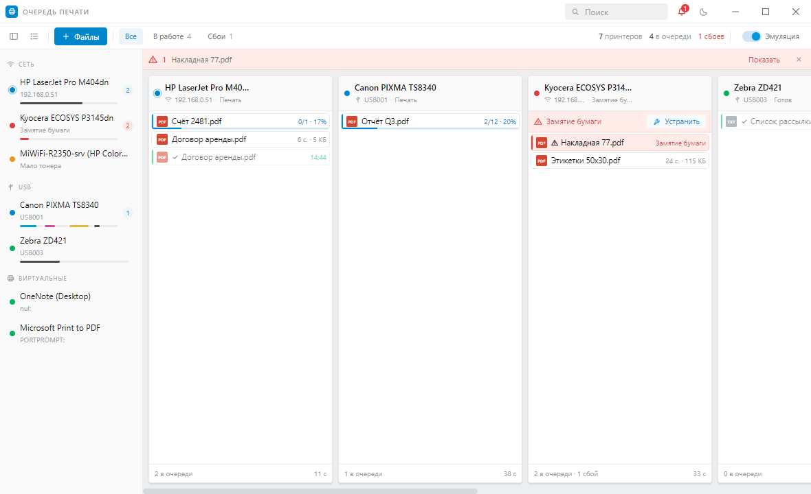
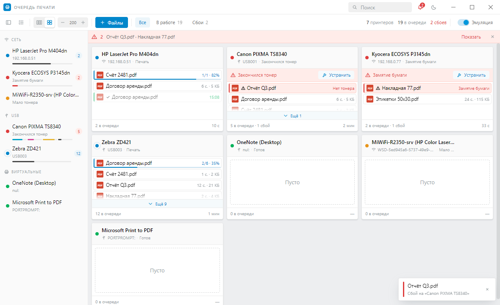
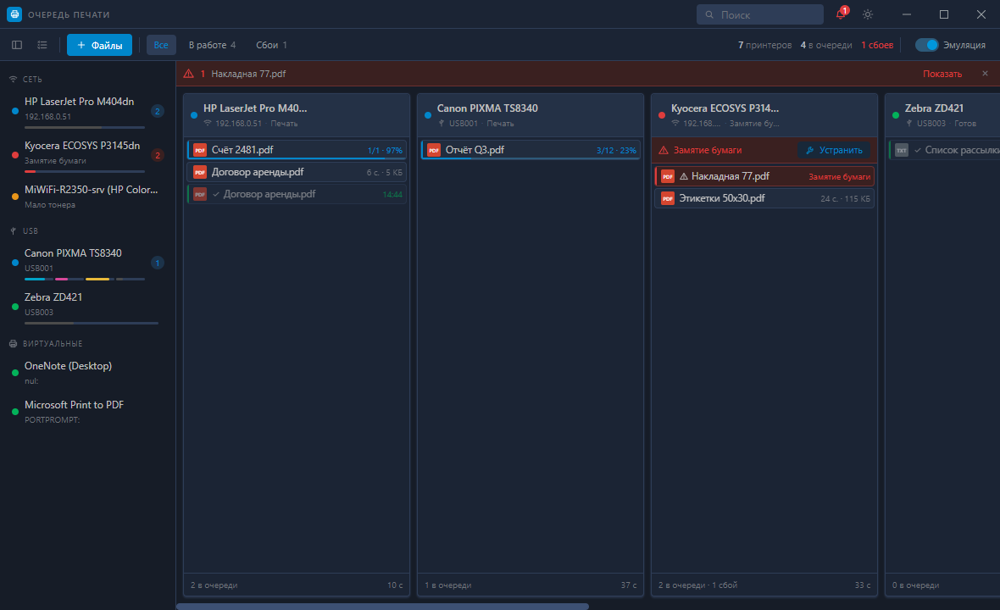

# Очередь печати

Компактный менеджер очередей печати для Windows 10/11. Все принтеры — сетевые и USB — в одном окне, задания перетаскиваются мышью между принтерами, у каждого файла есть предпросмотр, а сорванные печати отслеживаются до тех пор, пока файл не будет напечатан хоть где-нибудь.



## Что умеет

- **Принтеры.** Реальные принтеры Windows читаются из спулера (`Win32_Printer` / `Win32_PrintJob`): состояние, замятия, нехватка бумаги и тонера, тип подключения — IP, USB или виртуальный. Задание, отправленное на печать из любой программы, появляется в очереди само.
- **Очереди.** Колонка на принтер: задание, прогресс постранично, размер, время, оценка до конца очереди. Строка очереди — одна компактная строка в 24 px.
- **Два режима.** Колонки с горизонтальной прокруткой или сетка, которая раскладывается по ширине и высоте окна. В режиме «Авто» блоки делят высоту окна поровну, чтобы внизу не оставалось пустого места; кнопки «− +» задают высоту вручную. Если очередь не влезла в блок, кнопка «Ещё N» разворачивает остальные задания.
- **Свой порядок.** Колонки переставляются перетаскиванием за заголовок, лишние принтеры прячутся чекбоксами в списке — режим, размер, порядок и скрытые запоминаются.
- **Выделение и ПКМ.** Клик выделяет задание, Ctrl — добавляет, Shift — диапазон, Ctrl+A — всё. Правый клик открывает меню с выбором очереди: выделенные файлы уезжают на нужный принтер одним действием.
- **Прокрутка.** В режиме колонок колесо мыши листает доску по горизонтали; если очередь под курсором длиннее экрана, колесо сначала листает её.
- **Перетаскивание.** Задание таскается мышью между колонками и внутри колонки; можно бросить прямо на принтер в левой панели. Переносятся и задания из чужих программ — Lightroom, Word, что угодно (см. ниже). Файлы в очередь добавляются перетаскиванием из проводника в блок нужного принтера.
- **Имя принтера.** Клик по имени в левой панели переименовывает принтер — в самой Windows, так что новое имя видят и остальные программы.
- **Предпросмотр.** Иконка глаза или двойной клик: PDF, изображения и текст открываются прямо в окне, остальное — в системном приложении.
- **Сбои.** Любая неудачная печать поднимает предупреждение и попадает в список отслеживания. Как только тот же документ успешно печатается на **любом** принтере, предупреждение снимается автоматически, а задание помечается зелёным. Предупреждение можно закрыть и вручную.
- **Эмуляция.** Выключена по умолчанию. Тумблер «Эмуляция» добавляет ферму из четырёх виртуальных принтеров с реальным поведением — расход тонера и бумаги, замятия, обрывы сети — чтобы всё можно было проверить без парка железа.
- Светлая и тёмная темы, оформление — по дизайн-системе веб-конфигуратора Keenetic.





## Установка

Готовый установщик и архив — в [Releases](https://github.com/Andrey-Bedretdinov/print-queue/releases).

- `PrintQueue-<версия>-setup.exe` — установка **для всех пользователей компьютера** (в `Program Files`, запросит подтверждение UAC), ярлык «Очередь печати» на рабочем столе и в меню «Пуск».
- `PrintQueue-<версия>-win-x64.zip` — распаковать и запустить `Print Queue.exe`, без установки.

### Предупреждение SmartScreen

Сборка не подписана сертификатом, поэтому при первом запуске Windows покажет «Система Windows защитила ваш компьютер» → «Подробнее» → «Выполнить в любом случае». Это не детект вируса: Microsoft Defender файл проверяет и угроз не находит — предупреждение выдаётся любому исполняемому файлу без цифровой подписи и накопленной репутации.

Убирается это только подписью кода. Если появится сертификат (`.pfx`), достаточно положить его в секреты репозитория — сборка подхватит подпись сама:

- `CSC_LINK` — содержимое `.pfx` в base64;
- `CSC_KEY_PASSWORD` — пароль к нему.

Ничего в коде менять не нужно, workflow уже читает эти секреты.

## Сборка из исходников

```bash
npm ci
npm run dist
```

Результат — в `release/`. Для разработки: `npm run dev` (Vite + Electron с горячей перезагрузкой).

## Как устроено

| Слой | Файлы |
| --- | --- |
| Реальные принтеры | `electron/main/windows-source.ts` — один запрос на принтеры, порты и задания |
| Слежение за спулером | `electron/main/watcher.ts` — живой процесс PowerShell, снимок каждые 1,2 с |
| Перенос чужих заданий | `electron/main/spool.ts` — `AddJob`/`SetJob`/`ScheduleJob` поверх спул-файла |
| Эмуляция | `electron/main/simulator.ts` — тики по 250 мс, расход расходников, взвешенные отказы |
| Сведение и действия | `electron/main/manager.ts` — общий стейт, перенос заданий, жизненный цикл предупреждений |
| Отслеживание файлов | `electron/main/signature.ts` — подпись документа (имя + размер + страницы), общая для всех принтеров |
| Интерфейс | `src/` — React + dnd-kit + Framer Motion, токены Keenetic в `src/styles/tokens.css` |
| Иконка | `scripts/make-icon.mjs` — генерируется при сборке, в репозитории не хранится |

Состояние (настройки, окно, список сбоев) хранится в `%APPDATA%/Print Queue/state.json`.

### Перенос чужих заданий

Windows не умеет перекладывать задание из одной очереди в другую, но данные задания лежат на диске — `%SystemRoot%\System32\spool\PRINTERS\<id>.SPL`. Приложение ставит задание на паузу, читает спул-файл, заводит задание на целевом принтере через `AddJob`, копирует туда данные, восстанавливает исходный тип данных и расписывает его `ScheduleJob`, а исходное удаляет. Так переносятся задания из любой программы — Lightroom, Word, браузера.

Два условия:

- **права администратора** — спул-каталог не читается обычным пользователем. Если их нет, приложение скажет об этом и предложит перезапуститься с повышением;
- **одинаковый драйвер** у принтеров — данные в спул-файле подготовлены для конкретного драйвера. Для парка одинаковых машин это обычный случай.

Предпросмотр у чужих заданий недоступен: спулер отдаёт данные для принтера, а не исходный файл.

## Лицензия

MIT
